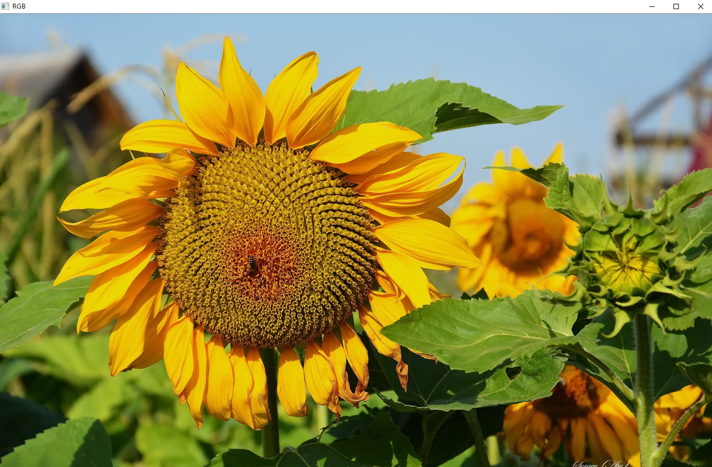
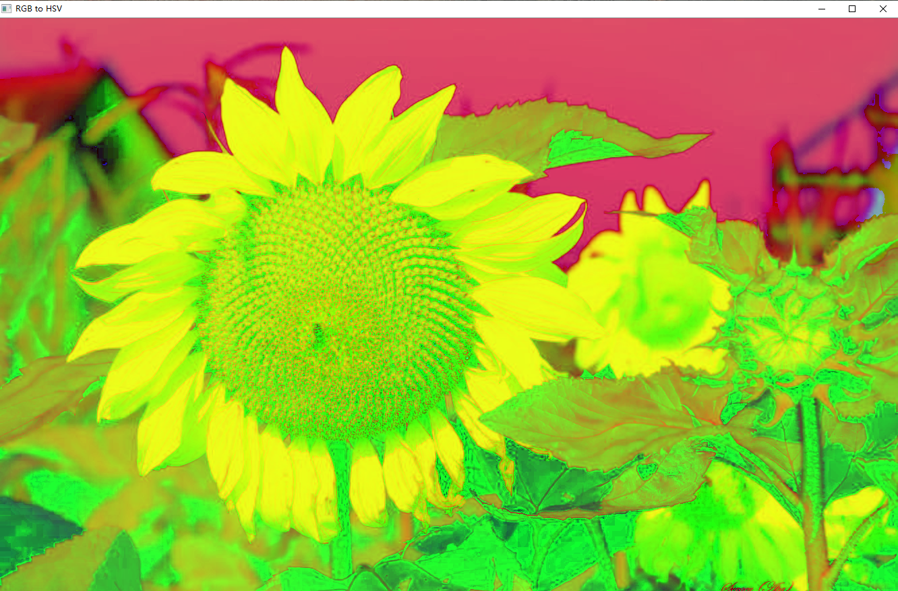
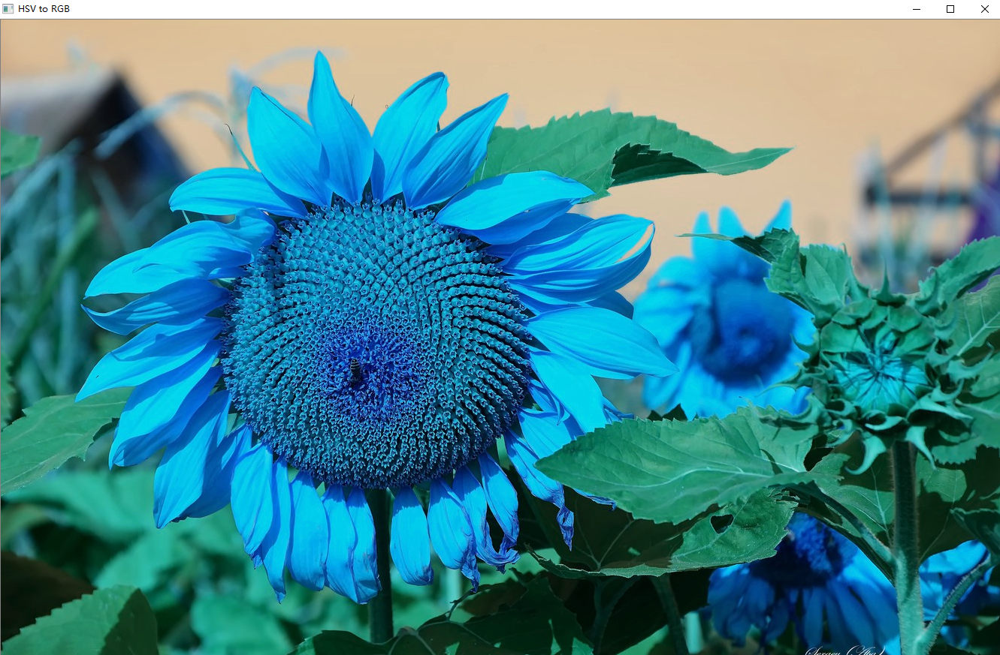
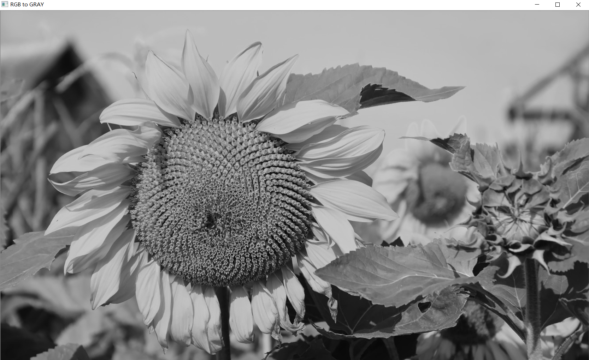
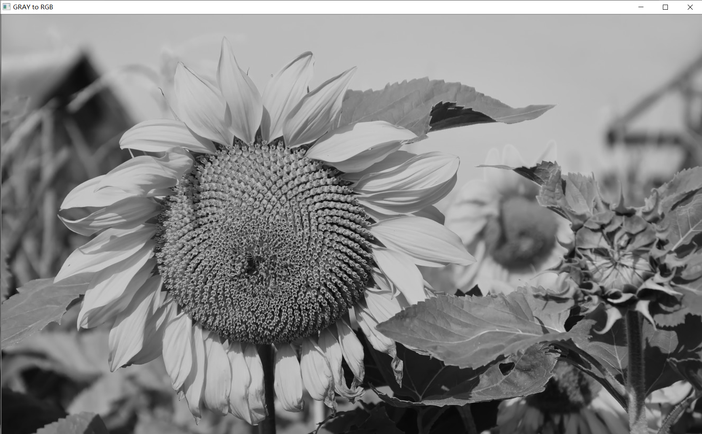

#    工程文件夹说明
## OpenCV在图像中的基本操作
### 色彩空间的基础知识
1.RGB空间
+ 首先RGB在图片信息中指的是三个通道的值，R代表red,G代表green,B代表blue
+ 在opencv中OpenCV默认的RGB彩色空间的通道顺序为BGR
+ 下面介绍图片在代码中的rgb通道的情况
1. 1 代码介绍

Inline `code`
    
    //img_rgb= imread("sun.jpg");
    上面就是利用opencv导入的sun图片,没有表明const值的情况下默认导入彩图，即rgb图


2.HSI空间

+ 是一个色调，饱和度和亮度描述空间，这个在web网页设计的画图中同样如此，HIS可以从彩色图像携带的彩色信息（色调和饱和度）中消除强度分量的影响，HIS空间对于开发基于彩色描述
的图像处理算法是一个理想的彩色空间
+ 如果认为rgb是三维向量的话，那么可以通过空间解算出来H,S,I的值
+ 而且在OpenCV中可以使用HSV(色调，饱和度和值)空间来隔离图像颜色与亮度信息，可以实现高效转换


3.灰色空间

+ 在很多的任务场景下，二值化的灰度图也是常用的颜色空间


### 色彩空间的转换

1.从RGB色彩空间转换到HSV

+ `code api`
```c++
    cvtColor(img_rgb,img_hsv,COLOR_BGR2HSV);    
```

2.从HSV色彩空间转换到RGB
+ `code api`

```c++
    cvtColor(img_hsv,img_hsv2rgb, COLOR_HSV2RGB);
```

3.从RGB图转换为GRAY 
+ `code api`
```c++
    cvtColor(img_rgb,img_gray,COLOR_BGR2GRAY);
```

4.从GRAY转换为RGB
+ `code api`
```c++
    cvtColor(img_gray,img_gray2rgb,COLOR_GRAY2BGR);
```
+ 此处说明，从RGB空间转换为灰度空间
  * 公式为 Y=0.2999*R+0.587*G+0.114*B
+ 从灰度图转换，可以发现灰度图转换RGB的彩图还是黑白的，原因可能是灰度图的值已经无法回到原图的R，G，B值
  * 公式为 R=Y,G=Y,B=Y


### 图片处理之后的结果图
1. 首先导入的是RGB图



2. 将RGB的图转为HSV色彩空间



3. 将HSV的图转换为RGB图



4. 将RGB的图转换为GRAY的图



5. 将GRAY的图转换为RGB图




#工程源码
```c++
#include <iostream>
#include "opencv2/opencv.hpp"
using namespace std;
using namespace cv;


int main() {
    Mat img_rgb,img_gray,img_hsv,img_gray2rgb,img_hsv2rgb;
    //导入向日葵图像
    img_rgb= imread("sun.jpg");
    cvtColor(img_rgb,img_hsv,COLOR_BGR2HSV);
    cvtColor(img_hsv,img_hsv2rgb, COLOR_HSV2RGB);
    cvtColor(img_rgb,img_gray,COLOR_BGR2GRAY);
    cvtColor(img_gray,img_gray2rgb,COLOR_GRAY2BGR);
    imshow("RGB",img_rgb); //显示rgb的值
    imshow("RGB to HSV",img_hsv);//显示rgb图转hsv的图
    imshow("HSV to RGB",img_hsv2rgb);//显示hsv转换为rgb的图
    imshow("RGB to GRAY",img_gray);//显示由色彩图转为灰度图
    imshow("GRAY to RGB",img_gray2rgb);//由灰度图变为色彩图
    //下面来输出各个色彩空间的通道数（用来描述图片的信息）
    cout<<"RGB image 通道数:"<<img_rgb.channels()<<endl;
    cout<<"HSV image 通道数:"<<img_hsv.channels()<<endl;
    cout<<"gray image 通道数:"<<img_gray.channels()<<endl;
    waitKey(0);
    return 0;

}

```